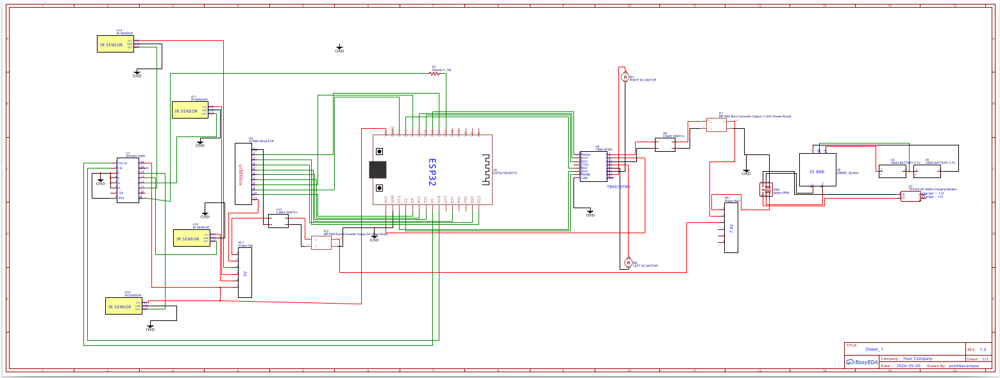

# 🏎️ Line Following Robot — ESP32 v8.0 (Intelligent AT Edition)

<p align="center">
  
</p>

<p align="center">
  
  
  
  
  
  
  
</p>

---

## 🏆 Competition Achievement

<p align="center">
  
</p>

> **🥉 3rd Place — 2nd Runner-Up** at the **BCI Campus Line Following Competition**
> Prize: **LKR 10,000** · Competed against university-level robotics teams.

This robot was designed, built, and programmed entirely from scratch, featuring a custom PCB chassis, self-designed power management system, and a fully original firmware stack with an Intelligent Dual-Profile Auto-Tuner.

---

## 📋 Table of Contents

- [Overview](#-overview)
- [Key Features & Innovations](#-key-features--innovations)
- [Hardware Architecture](#-hardware-architecture)
- [Circuit Connections](#-circuit-connections)
- [Software Architecture](#-software-architecture)
- [PID Configuration](#-pid-configuration)
- [Auto-Tune System (AT8)](#-auto-tune-system-at8)
- [Web Interface](#-web-interface)
- [Installation & Flashing](#-installation--flashing)
- [Usage Instructions](#-usage-instructions)
- [Bug Fixes & Optimizations](#-bug-fixes--optimizations)
- [Project Gallery](#-project-gallery)
- [Tech Stack](#-tech-stack)
- [License](#-license)

---

## 🔭 Overview

This project is a **high-performance autonomous line-following robot** built on the **ESP32** microcontroller platform. The robot navigates a track using a reflectance sensor array, resolves maze-like junctions using a Right-Hand Rule navigation state machine, and achieves maximum speed by running N20 motors significantly above their rated voltage through a boost converter topology.

The firmware (`real_finel.cpp`) is a **~2,500-line, production-grade C++ codebase** featuring a real-time PID control loop running at **200 Hz (5 ms tick)** on a dedicated FreeRTOS core, a live-streaming WebSocket dashboard, and a fully autonomous Intelligent Auto-Tune engine (AT8) that tunes PID constants without any human intervention.

---

## ✨ Key Features & Innovations

### 1. 🧠 Intelligent Dual-Profile Adaptive Auto-Tuner (AT8)

The most unique subsystem in this firmware is the **AT8 Auto-Tuner** — a completely original algorithm that autonomously discovers optimal PID constants for both straight-line and cornering scenarios.

| AT8 Feature | Description |
|---|---|
| **State Persistence (NVS)** | Saves tuning progress to ESP32 Non-Volatile Storage after every speed escalation. Power-cycles or crashes resume from the last checkpoint — never from scratch. |
| **Dual PID Profiles** | Independently tunes a *Straight Profile* (`kpS`, `kdS`) and a *Turn Profile* (`kpT`, `kdT`) using a terrain state machine that classifies each tick as `STRAIGHT`, `TURN_90`, or `UNKNOWN`. |
| **Terrain-Gated IAE** | The Integral of Absolute Error (IAE) fitness score only accumulates ticks that match the *target terrain* (e.g., straight-section error is never contaminated by corner oscillation data). |
| **Bidirectional Twiddle (Coordinate Descent)** | Tries `param + dp` and `param - dp` per iteration. On improvement, `dp` grows by ×1.05; on failure, `dp` shrinks by ×0.95. Convergence triggers when `Σdp < 0.005`. |
| **Progressive Speed Escalation** | Twiddle converges at one speed level, then the robot escalates by 10 PWM and re-tunes. No artificial PWM ceiling — the robot escalates until it stalls or loses the line. |
| **Wobble / Oscillation Analysis** | Rolling RMS window (80 samples) detects heavy wobble (`RMS > 330`). During the SETTLE phase, Kp is micro-stepped down by `0.005` per tick to prevent catastrophic over-correction at 11.4V. |
| **Straight-Profile Lock (Welford Variance)** | Uses Welford's online algorithm to compute error variance without numerical drift. After 3 consecutive windows with `variance < 3200`, the straight profile is permanently frozen. |
| **Emergency Interrupt Brake (GPIO 34)** | An `IRAM_ATTR` ISR on GPIO 34 triggers a TB6612FNG active electronic brake (200 ms hard lock) before transitioning to IDLE and saving a NVS checkpoint. |

### 2. ⚡ Motor Overvolting with Boost Converter

N20 6V-rated motors are driven at **11.40V** via a custom MP1584 boost converter topology. This approximately doubles the achievable top speed at the cost of reduced motor longevity — an engineering trade-off deliberately chosen for competition performance.

### 3. 🔢 3-Mode Dynamic PID with EMA D-Term

The firmware implements three PID operating modes that switch automatically based on track error magnitude:

| Mode | Trigger Condition | Role |
|------|-------------------|------|
| **M0 — Straight** | `|error| < 800` | High-speed straight-line tracking |
| **M1 — Curve Near** | `800 ≤ |error| < 1800` | Moderate cornering |
| **M2 — Curve Far** | `|error| ≥ 1800` | Aggressive cornering |

The derivative term uses **Exponential Moving Average (EMA) filtering** (`α = 0.25`) to suppress sensor noise that would otherwise cause motor PWM spikes.

### 4. 🛑 ABS Junction Braking System

A dedicated **Anti-lock Braking System** fires when forward-looking IR sensors detect an upcoming junction:

- **6cm trigger (S1/S4 outer sensors):** Full TB6612FNG electronic brake cycles — both IN pins driven HIGH with PWM=255, locking the motor shaft instantly.
- **2cm fail-safe (S2/S3 inner sensors):** Validates remaining speed and applies a single emergency cycle if the robot is still over-speed.
- **Math Fallback:** When look-ahead hardware is unavailable, a `de/dt` threshold-based software brake activates automatically.

### 5. 🗺️ Maze-Solving Navigation State Machine

The robot implements a **Right-Hand Rule** maze solver with 7 navigation states:

```
LINE_FOLLOW → AT_INTERSECTION → INTER_TURN_L / INTER_TURN_R
                              → DASHED_FWD
                              → DEAD_END_UTURN → PIVOT_SEARCH
```

Key navigation innovations:
- **Node Map FIFO [U5]:** 16-node circular buffer records junction signatures (`dirsAvail` bitmask). Revisited junctions use stored path data to avoid re-exploring dead ends.
- **Anti-Backtrack [U6]:** After a U-turn, the robot blocks all previously-tried directions at the next junction, forcing exploration of untried paths.
- **45° Dummy Line Filter [U7]:** Detects diagonal track markings by measuring `de/dt` sweep rate. Sweeps faster than `900 units/tick` for 4 consecutive ticks trigger a suppression cooldown of 25 ticks.
- **Directional Memory Recovery [U3]:** On line loss, the robot spins toward the *last known line direction* rather than performing a random alternating search.

### 6. 📡 Hardware Look-Ahead via 74HC165 Shift Register

Four independent IR sensors are read via a **SN74HC165N** parallel-to-serial shift register, extending the sensor array without consuming additional ESP32 GPIOs. The look-ahead sensors trigger at 6cm and 2cm ahead of the junction, providing enough time for the ABS system to act even at high speed.

### 7. 🔄 Asymmetric Velocity Ramp [U10]

All motor transitions use an asymmetric ramp:
- **Acceleration rate:** 25 PWM/tick (~3,000 PWM/s)
- **Deceleration rate:** 25 PWM/tick (~5,000 PWM/s)

This eliminates the jerky speed changes that previously caused wheel slip at junction entries and post-turn restarts.

### 8. 🌐 Real-Time Wi-Fi Web Dashboard

The ESP32 hosts its own **Wi-Fi Access Point** (`SSID: LineFollower`, `Pass: robot1234`) and serves a single-page WebSocket dashboard from PROGMEM:

- Live sensor bar graph, error bar, PWM readouts
- AT8 live telemetry: terrain classification, active Kp/Kd, IAE counter, dp convergence sum
- PID Tuner with per-mode tabs (M0/M1/M2) and bidirectional sync
- Manual D-pad drive control
- ABS manual brake test trigger
- Persistent log viewer with colour-coded severity

---

## 🔩 Hardware Architecture

<p align="center">
  
</p>

> 📄 Full schematic: [`hardware_diagram.pdf`](hardware_diagram.pdf) — open in any PDF viewer for full resolution.
> Designed in **EasyEDA** · Rev 1.0 · Date 2026-05-05 · Author: `avishkacampus`

### Block Diagram

```
  ┌─────────────────────────────────────────────────────────┐
  │                   POWER SYSTEM                           │
  │  2× 18650 Li-Ion (3.7V each)  →  2S BMS  →  7.4V Rail  │
  │  7.4V  →  MP1584 Boost   →  11.40V  →  Motors (VM)      │
  │  7.4V  →  MP1584 Step-Down  →  5V    →  Logic (VCC)      │
  │  TP5100 2A Charging Module  ←  12V Charger               │
  └─────────────────────────────────────────────────────────┘
              │                        │
              ▼                        ▼
  ┌───────────────────┐    ┌─────────────────────────┐
  │   ESP32 DevKit V1 │    │   TB6612FNG Motor Driver │
  │   (Controller)    │◄──►│   AIN1/AIN2 / BIN1/BIN2  │
  │   Wi-Fi AP        │    │   PWMA (GPIO25) / PWMB   │
  │   FreeRTOS 2 Core │    │   VM = 11.40V            │
  └───────────────────┘    └───────────┬─────────────┘
          │   │                        │
          │   └──── 74HC165 ◄── 4× IR  │   ← Look-Ahead (6cm + 2cm)
          │          Shift Reg          │
          │                        ┌───┴───┐ ┌───────┐
          └──── QTR-8RC Array      │ Left  │ │ Right │
               (8 sensors)         │  N20  │ │  N20  │
                                   │ Motor │ │ Motor │
                                   └───────┘ └───────┘
```

---

## 🔌 Circuit Connections

### ESP32 → TB6612FNG Motor Driver

| ESP32 GPIO | TB6612FNG Pin | Function |
|------------|---------------|----------|
| GPIO 25 | PWMA | Left Motor PWM |
| GPIO 26 | AIN1 | Left Motor Direction 1 |
| GPIO 27 | AIN2 | Left Motor Direction 2 |
| GPIO 2 | PWMB | Right Motor PWM |
| GPIO 12 | BIN1 | Right Motor Direction 1 |
| GPIO 15 | BIN2 | Right Motor Direction 2 |

### ESP32 → QTR-8RC Sensor Array

| ESP32 GPIO | QTR-8RC Pin | Sensor |
|------------|-------------|--------|
| GPIO 23 | S0 | Sensor 0 (Leftmost) |
| GPIO 22 | S1 | Sensor 1 |
| GPIO 21 | S2 | Sensor 2 |
| GPIO 17 | S3 | Sensor 3 |
| GPIO 16 | S4 | Sensor 4 |
| GPIO 14 | S5 | Sensor 5 |
| GPIO 13 | S6 | Sensor 6 |
| GPIO 4 | S7 | Sensor 7 (Rightmost) |
| GPIO 33 | CTRL | IR Emitter Enable |

### ESP32 → 74HC165 Shift Register (Look-Ahead)

| ESP32 GPIO | 74HC165 Pin | Function |
|------------|-------------|----------|
| GPIO 5 | PL (Pin 1) | Parallel Load |
| GPIO 18 | CLK (Pin 2) | Clock |
| GPIO 32 | Q7 (Pin 9) | Serial Data Out |

### Look-Ahead IR Sensor Assignment (via 74HC165)

| Bit | Sensor | Position | Trigger Distance |
|-----|--------|----------|-----------------|
| Bit 4 | S1 | Left End | 6 cm ahead |
| Bit 5 | S2 | Left Mid | 2 cm ahead |
| Bit 6 | S3 | Right Mid | 2 cm ahead |
| Bit 7 | S4 | Right End | 6 cm ahead |

### Power & Miscellaneous

| ESP32 GPIO | Component | Function |
|------------|-----------|----------|
| GPIO 34 | Emergency Brake Button | Active-LOW, requires external 10kΩ pull-up to 3.3V |

> ⚠️ **Note on GPIO 34:** This is an input-only pin on the ESP32. It has **no internal pull-up resistor** — the external 10kΩ resistor to 3.3V is **mandatory** for the emergency brake ISR to function correctly.

---

## 💻 Software Architecture

### FreeRTOS Task Architecture

```
Core 0 (Wi-Fi / Web)         Core 1 (Real-Time Control)
┌─────────────────────┐      ┌──────────────────────────┐
│  taskWeb            │      │  taskControl             │
│  Priority: 3        │      │  Priority: 10            │
│  Stack: 4096 bytes  │◄────►│  Stack: 8192 bytes       │
│  ~10 Hz broadcast   │      │  200 Hz (5 ms tick)      │
│  WebSocket handler  │      │  PID + AT8 + Navigation  │
└─────────────────────┘      └──────────────────────────┘
        │                                │
        └──── Shared via portMUX mutexes ┘
             (gPidMux, gAtMux, gTelMux,
              gAt8Mux, gEBrakeMux, ...)
```

### Control Loop Flow (5 ms tick)

```
[Tick Start]
    │
    ├── 1. QTR-8RC Read + Normalize
    ├── 2. 74HC165 Shift Register Read (look-ahead)
    ├── 3. Position Calculation (weighted centroid)
    ├── 4. [U7] 45° Dummy Line Filter (de/dt analysis)
    ├── 5. End-Zone / Cross Detection + Debounce
    ├── 6. [AT8-5] Emergency Brake ISR Check
    ├── 7. Navigation State Machine (7 states)
    ├── 8. [ABS] Hardware ABS State Machine
    │        ├── 6cm trigger (TB6612FNG hard brake cycles)
    │        ├── 2cm fail-safe
    │        └── Math fallback (de/dt threshold)
    ├── 9. PID Computation OR AT8 Auto-Tune Block
    │        ├── Mode Selection (M0/M1/M2 by |error|)
    │        ├── [AT8-3] Terrain Classification
    │        ├── [AT8-2] Wobble RMS Analysis
    │        ├── [AT8-4] Twiddle Coordinate Descent
    │        └── Terrain-Gated IAE Accumulation
    ├── 10. [U10] Velocity Ramp (asymmetric accel/decel)
    ├── 11. Motor Deadband + TB6612FNG Output
    └── 12. Telemetry Snapshot → gTel (broadcast by taskWeb)
```

---

## 🎛️ PID Configuration

### Default Competition-Tuned Parameters (11.2V VM)

| Parameter | M0 — Straight | M1 — Curve Near | M2 — Curve Far |
|-----------|--------------|-----------------|----------------|
| **Kp** | 0.550 | 0.900 | 1.400 |
| **Ki** | 0.000 | 0.000 | 0.000 |
| **Kd** | 9.0 | 14.0 | 22.0 |
| **Base Speed (PWM)** | 110 | 70 | 48 |
| **Top Speed (PWM)** | 140 | 90 | 68 |
| **Low Speed (PWM)** | 60 | 40 | 28 |

> 💾 PID values are persisted to **ESP32 NVS** (Non-Volatile Storage) and survive power cycles. Use the Web UI to update them live without reflashing.

### Sensor Constants

| Constant | Value | Description |
|----------|-------|-------------|
| `QTR_SETPOINT` | 3500 | Target position (centred on track) |
| `QTR_TIMEOUT_US` | 1500 µs | RC discharge timeout |
| `QTR_LOST_THR` | 400 | Line-visible threshold |
| `HYBRID_MODE1_ERR` | 800.0 | M0→M1 PID mode switch threshold |
| `HYBRID_MODE2_ERR` | 1800.0 | M1→M2 PID mode switch threshold |
| `D_EMA_ALPHA` | 0.25 | D-term EMA filter coefficient |
| `MOTOR_DEADBAND` | 25 | Minimum PWM to overcome stiction |

---

## 🤖 Auto-Tune System (AT8)

### Quick Start

1. Connect to Wi-Fi AP: **SSID:** `LineFollower` · **Password:** `robot1234`
2. Open browser: `http://192.168.4.1`
3. Navigate to **AutoTune** tab
4. Select mode (M0 for full run, M1/M2 for turn-only)
5. Set start speed and click **▶ Start AutoTune**
6. When complete, click **✓ Apply & Save** in the result modal

### AT8 Tuning Modes

| Mode | Target | Suitable Track Section |
|------|--------|----------------------|
| **M0 Straight** | Tunes `gPID[0]`, then `gPID[1]` + `gPID[2]` | Full track with straights + corners |
| **M1 Curve 90°** | Tunes `gPID[1]` only | Closed loop with 90° corners |
| **M2 S-Curve** | Tunes `gPID[2]` only | S-curve section |
| **Corner Sweep** | Finds max safe corner speed | Any loop with corners |

### AT8 Key Parameters

| Constant | Value | Description |
|----------|-------|-------------|
| `AT8_SPD_START` | 200 PWM | Initial escalation speed |
| `AT8_SPD_STEP` | 10 PWM | Speed increment per convergence |
| `TWIDDLE_DONE_SUM` | 0.005 | Convergence threshold (Σdp) |
| `TWIDDLE_EVAL_TICKS` | 200 | Terrain-filtered IAE window |
| `WOBBLE_HEAVY_RMS` | 330.0 | Kp micro-reduction trigger |
| `STRAIGHT_LOCK_VAR_THR` | 3200.0 | Variance threshold for straight lock |
| `STRAIGHT_LOCK_HITS` | 3 | Consecutive stable windows to lock |

---

## 🌐 Web Interface

The robot hosts a full-featured mobile-optimised dashboard. No app installation is required.

| URL | `http://192.168.4.1` |
|-----|----------------------|
| **Wi-Fi SSID** | `LineFollower` |
| **Password** | `robot1234` |
| **Protocol** | WebSocket (`ws://192.168.4.1/ws`) |
| **Broadcast Rate** | ~10 Hz |

### Dashboard Tabs

| Tab | Features |
|-----|----------|
| 📊 **Dash** | Live position, error, PWM, QTR sensor bars, look-ahead indicators, nav state badges |
| 🎮 **Control** | Start / Stop / Calibrate, feature toggles (look-ahead, IR emitters) |
| ⚙️ **PID** | M0/M1/M2 tabs, live Kp/Ki/Kd/speed editing, bidirectional "Load from Robot" sync |
| 🔬 **AutoTune** | AT8 live telemetry, mode selection, speed sliders, NVS reset, ABS brake test |
| 🕹️ **Drive** | D-pad manual drive with variable speed slider |
| 📝 **Log** | Colour-coded ring buffer log (500 lines) with auto-scroll |

---

## 📦 Installation & Flashing

### Prerequisites

| Tool | Version |
|------|---------|
| Arduino IDE | 2.x or later |
| ESP32 Board Package | `espressif/arduino-esp32` ≥ 2.0.0 |
| AsyncTCP | ≥ 1.1.1 |
| ESPAsyncWebServer | ≥ 1.2.3 |
| ArduinoJson | ≥ 6.x |

### Steps

```bash
# 1. Clone the repository
git clone https://github.com/<your-username>/line-following-robot.git
cd line-following-robot

# 2. Open src/real_finel.cpp in Arduino IDE

# 3. Set board: ESP32 Dev Module
#    Partition Scheme: Default 4MB with SPIFFS
#    CPU Frequency: 240 MHz
#    Flash Frequency: 80 MHz

# 4. Flash
# Connect ESP32 via USB and click Upload (Ctrl+U)
```

### Board Settings Summary

| Setting | Value |
|---------|-------|
| Board | ESP32 Dev Module |
| Upload Speed | 921600 |
| CPU Frequency | 240 MHz |
| Flash Frequency | 80 MHz |
| Flash Mode | QIO |
| Partition Scheme | Default 4MB with SPIFFS |
| Core Debug Level | None |

---

## 🚀 Usage Instructions

### First Run

1. **Power on** the robot. The ESP32 boots and hosts the Wi-Fi AP.
2. Connect your phone/laptop to `LineFollower` Wi-Fi.
3. Open `http://192.168.4.1` in a browser.
4. Go to **Control** tab → tap **⚙ CALIBRATE**.
5. The robot performs a 3-pass sweep over the line. Monitor sensor ranges in the **Log** tab.
6. After calibration, the Web UI confirms sensor health and the active braking system (`HARDWARE (HLA)` or `MATH-BRAKING`).
7. Place the robot on the start line → **Control** tab → **▶ START**.

### Calibration Tips

- Ensure the robot is placed directly **on** the line before calibrating.
- The calibration sweep covers ±1 robot-width. If the line is very thin (< 15mm), extend sweep duration by modifying `qtrCalibRun(700)` arguments.
- If fewer than 4 sensors report `OK (range > 100 µs)`, check sensor-to-floor gap (optimal: 3–6 mm) and the potentiometer on the QTR board.

### Emergency Stop

- **Web UI:** Tap **■ STOP** on the Control tab.
- **Hardware:** Press the emergency brake button on GPIO 34. The robot locks both motors for 200 ms, then coasts to a stop.

---

## 🐛 Bug Fixes & Optimizations

The firmware development involved identifying and resolving numerous subtle real-time issues. The following were the most technically significant:

### `[BUG4-FIX]` Duplicate Speed Escalation in Twiddle
**Problem:** Two separate code paths — one for `STR_TUNE` and one for `TRN_TUNE` — both triggered the speed escalation routine. This caused the PWM level to increment **twice** per convergence event, jumping the robot past the intended escalation step and destabilising the next tuning round.
**Fix:** Unified all escalation logic into a single site inside the main Twiddle convergence block. The duplicate `TRN_TUNE` escalation path was removed entirely.

### `[BUGFIX-1]` Probe Revert Before `dp` Reset on Speed Step
**Problem:** When Twiddle converged and a speed step was triggered, the "advance param" code had already applied `+dp` to the next parameter as a probe. When `dp` was then reset to its initial value, the new speed level's Twiddle baseline started from `best_param + old_dp` — an increasingly skewed starting point on every escalation.
**Fix:** The probe (`*nPar = constrain(*nPar - *nDp, ...)`) is now explicitly reverted before the dp reset, ensuring every new speed level starts from the clean best-known value.

### `[BUGFIX-2a/2b]` Stale Welford Variance and Wobble Buffer After Speed Step
**Problem:** The Welford variance window and the wobble RMS ring buffer were not cleared when the robot escalated speed. Cross-speed data mixed into the variance window artificially suppressed the calculated variance, causing the straight profile to lock prematurely. Similarly, old low-speed error samples in the wobble buffer triggered false Kp micro-reductions during the SETTLE phase at the new higher speed.
**Fix:** Both buffers are explicitly wiped (`memset` + index reset) on every speed escalation step.

### `[FIX-END-STUCK]` False Race Finish at Thick Junctions
**Problem:** End-zone detection used `allBlack` (all sensors ≥ `QTR_LOST_THR` = 400), which fired falsely at slow T-junctions after ABS braking reduced speed. The `endDetectTicks` counter reached its threshold before the cross debounce could reject the false positive.
**Fix:** Changed the condition to `blackCount >= 8` (all 8 sensors above the higher `CROSS_BLACK_THR` = 700 threshold). A true finish box always saturates all 8 sensors; a junction line only triggers 4–6.

### `[FIX-LA-STUCK]` Look-Ahead Hardware False Positive Suppression
**Problem:** At certain track angles, the look-ahead sensors read the main line as a junction, causing all 4 sensors to latch `HIGH` permanently and triggering ABS at every tick in `LINE_FOLLOW` state.
**Fix:** A debounce counter detects when all 4 sensors are simultaneously `HIGH` for more than 1.5 seconds (300 ticks). On detection, the hardware look-ahead system is automatically disabled and the system falls back to math-based braking. Normal operation resumes when sensors return to a mixed pattern.

### `[FIX-EFFKP]` Stale Gain After Mode Transition
**Problem:** When the robot transitioned from `AUTO_TUNING` or `STOPPED` back to `RUNNING`, `effKp` and `effKd` retained the high-mode values from the previous run (e.g., M2 `Kp=1.4`). This caused 10–15 ticks of excessive correction on restart.
**Fix:** `effKp` and `effKd` are reset to the M0 baseline (`wp[0].kP`, `wp[0].kD`) every non-running tick in the state guard.

### `[FIX-TURN]` Speed Overshoot at Turn Entry
**Problem:** Turn execution used `wp[1].base` directly as the pass-through speed without accounting for the ABS-braked `effBase`. If ABS had reduced speed to M1 level, the robot lurched forward to the full M1 base at the moment a junction was confirmed.
**Fix:** Pass-through speed at turn entry is now `min(wp[1].base, (int)effBase)`, respecting whatever speed the braking system had already established.

### `[FIX] Unified Base-Speed Ramp Path`
**Problem:** The look-ahead braking and normal speed recovery used two separate smooth-lerp operations that ran in the same tick against `effBase` — simultaneously ramping it up toward `p->base` and down toward `laTargetBase`, creating a mathematical tug-of-war that negated braking effectiveness.
**Fix:** A single unified velocity ramp now governs all base-speed transitions. Deceleration uses the fast `velRamp` path; acceleration uses the smooth ALPHA lerp.

---

## 🖼️ Project Gallery

| Robot Side View | Robot Top View |
|:-:|:-:|
|  |  |

| Competition Run | Award Ceremony |
|:-:|:-:|
|  |  |

> *Images referenced above correspond to uploaded files:*
> `Side.jpeg` · `Top.jpeg` · `Robot_on_Track.jpeg` · `Award_ceremony.jpeg`

---

## 🛠️ Tech Stack

### Hardware Components

| Component | Part | Purpose |
|-----------|------|---------|
| **Microcontroller** | ESP32 DevKit V1 | Dual-core 240MHz ARM, Wi-Fi AP, FreeRTOS |
| **Motor Driver** | TB6612FNG | Dual H-bridge, 1.2A cont., active electronic brake |
| **Reflectance Sensors** | QTR-8RC (8 sensors) | Line position (weighted centroid) |
| **Look-Ahead Sensors** | 4× IR reflectance | Junction detection at 6cm and 2cm |
| **Shift Register** | SN74HC165N | Parallel-to-serial, GPIO multiplexing |
| **Drive Motors** | N20 DC (6V rated) | Run at 11.40V for competition speed |
| **Battery** | 2× 18650 Li-Ion 3.7V | Series connected, 7.4V nominal |
| **BMS** | 2S BMS module | Over-charge, over-discharge, short-circuit protection |
| **Boost Converter** | MP1584 (×1) | 7.4V → 11.40V, powers motor driver VM |
| **Step-Down Converter** | MP1584 (×1) | 7.4V → 5V, powers all 5V logic |
| **Charging Module** | TP5100 2A | 12V charger input, 18650 CC/CV charging |
| **Chassis** | Custom perfboard | Manually soldered, modular layout |

### Software & Firmware

| Technology | Usage |
|-----------|-------|
| **C++ / Arduino IDE** | Firmware development |
| **FreeRTOS** | Dual-core task scheduling (Control @ Core 1, Web @ Core 0) |
| **ESPAsyncWebServer** | Non-blocking HTTP server |
| **AsyncTCP** | Underlying async TCP stack |
| **ArduinoJson** | JSON serialisation for WebSocket telemetry |
| **ESP32 Preferences (NVS)** | PID and AT8 checkpoint persistence |
| **LEDC (ESP32 PWM)** | 20kHz PWM generation for motor control |
| **EasyEDA** | Circuit schematic design |

---

## 📄 License

This project is released under the [MIT License](LICENSE).

You are free to use, modify, and distribute this code and hardware design for personal and educational purposes. Attribution is appreciated.

---

<p align="center">
  <strong>Built with ❤️ for the BCI Campus Line Following Competition</strong><br/>
  <em>ESP32 · C++ · FreeRTOS · TB6612FNG · QTR-8RC · 11.4V Overvolted N20 Motors</em>
</p>
